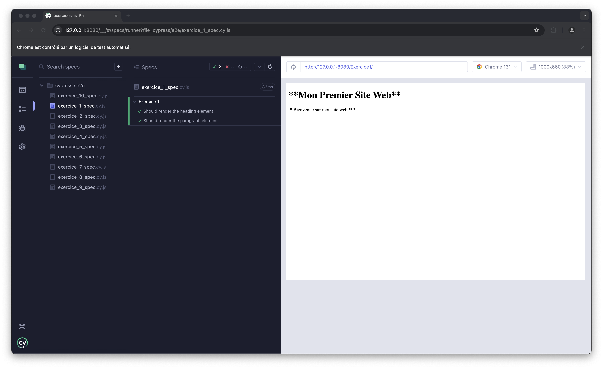
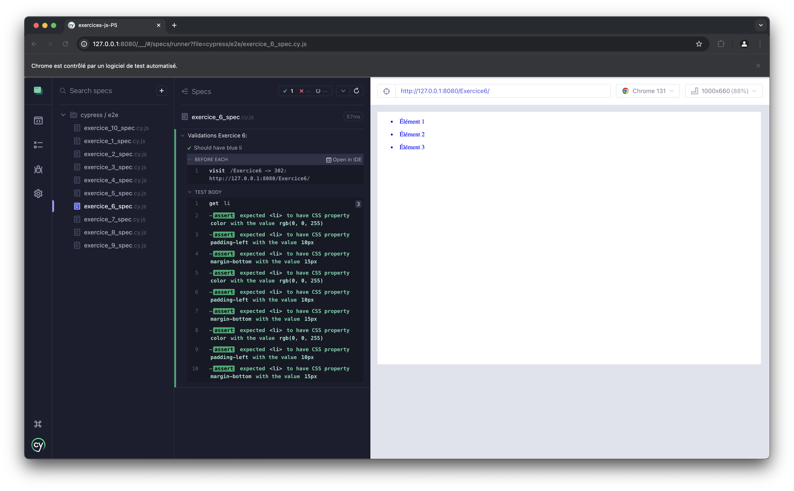
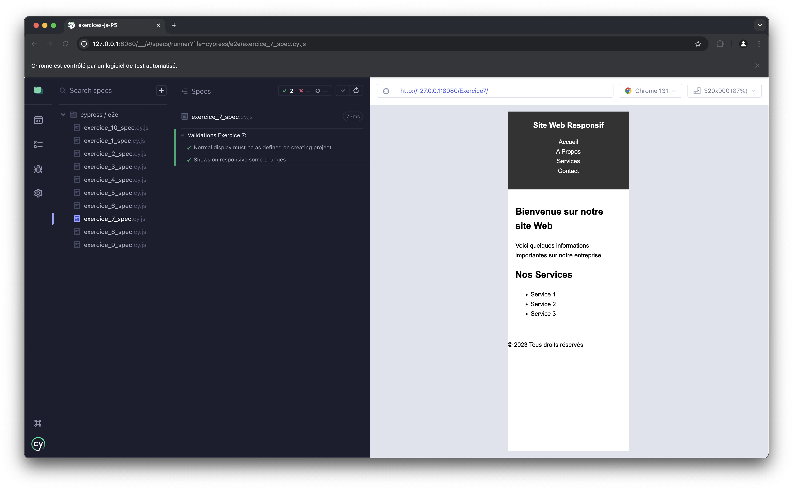
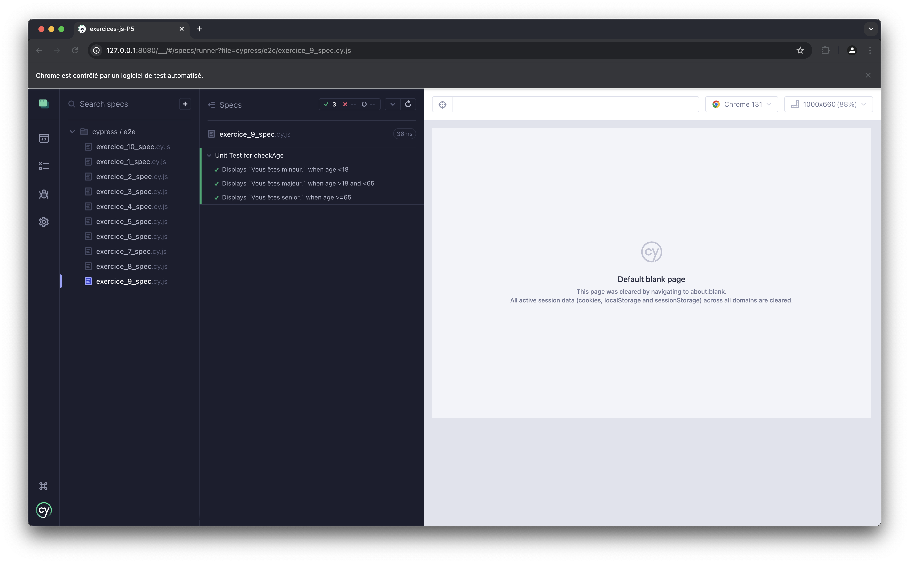

# Projet 5 : Testez vos compétences, les langages du web

## Énoncé

Pour commencer le projet, lancez la commande `npm install` qui installera les dépendances du projet. 
 
Vous pourrez ainsi réaliser les différents exercices. 

Pour vérifier que votre exercice est correctement réalisé vous n'avez qu'à lancer la commande `npm start` puis la commande `npm run test`. 
Vous verrez alors s'afficher l'application `Cypress`. 
Sélectionnez `E2E Testing` puis sélectionnez le navigateur dans lequel vous voulez lancer vos tests. 

Si votre code est correct alors les tests seront décrits en vert. 

Bon entraînement !

## Tests réussis

# Exercice 1

# Exercice 2

# Exercice 3

# Exercice 4

# Exercice 5

# Exercice 6

# Exercice 7

# Exercice 8

# Exercice 9

# Exercice 10

